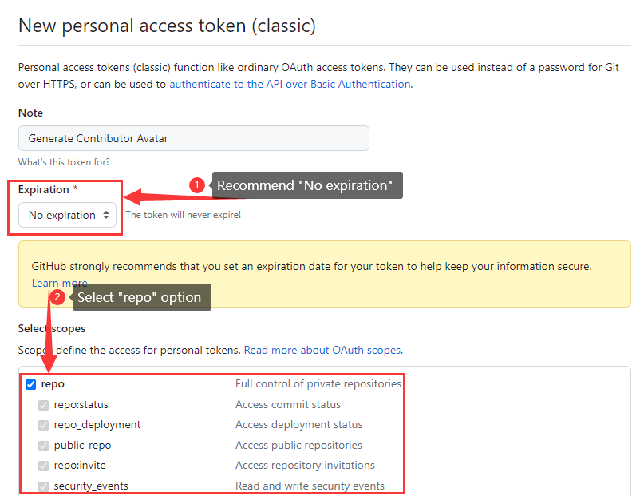
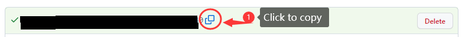

# readme-avatar
A node project for everyone to add contributor's avatar into your readme file

---
## Use Method
1. New a repository & Clone the repository to local
2. Enter the folder and prepare for the environment
```
cd readme-avatar
npm init -y
npm install request fs
```
3. Edit `README.md` file
> MENTINON: The file name must be `README.md`
    
    Add a label of contributors' holder in the `README.md` file
```
<!-- CONTRIBUTORS_AVATARS -->
```
4. [Create a Token](https://github.com/settings/tokens/new) below the owner's control

5. Copy the Token value after generate token (button is at the bottom of the Create Token page)

6. Run script with two arguements
```
node .\contributors-avatar.js <repo name> <access token>
```
|    Argument    |                                                Description                                                |         Example        | Required |
|:--------------:|:---------------------------------------------------------------------------------------------------------:|:----------------------:|:--------:|
|   `repo name`  |                    The repository that you want to get the list of contributor list of.                   | jinjieup/readme-avatar |     ✔    |
| `access token` | In order to use Github RESTFUL API to get the list of the contributor, you must provide the access token. |         (None)         |     ✔    |

---
## Release Note
- 2023-06-14 v1.0.0

    Create Project With Primary Features

---
## Contributors

<br>

---
## License
[MIT LICENSE](./LICENSE)